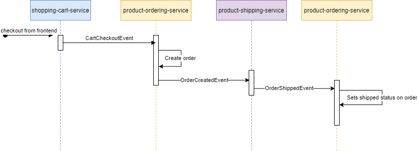
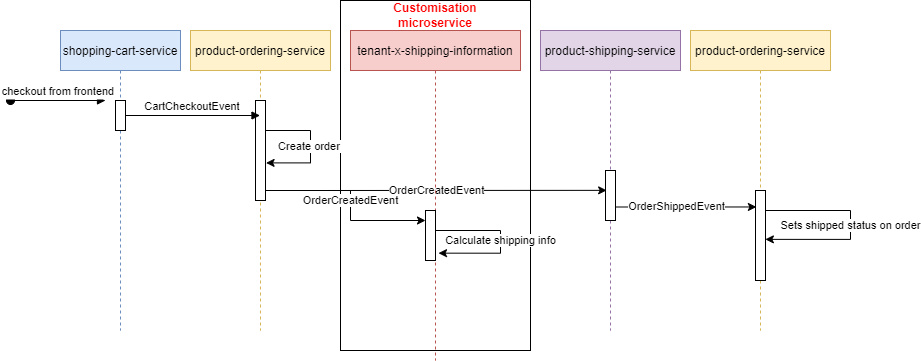
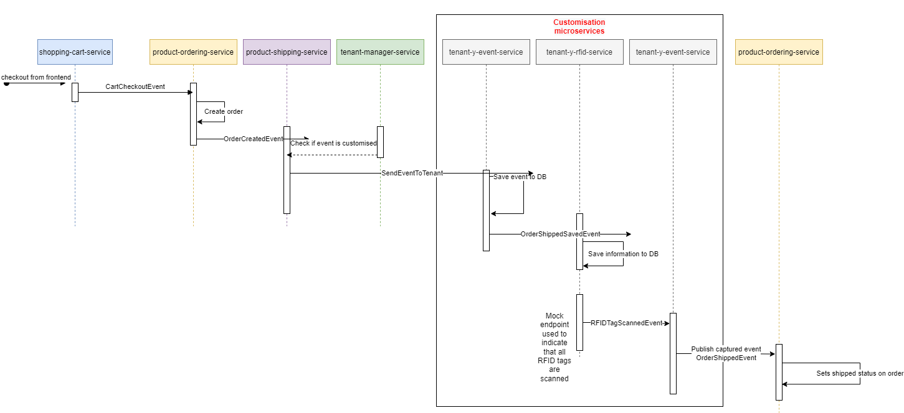

<h2>TODO</h2>

<ul>
    <li>Change product-ordering-service to save user as well in order, and only fetch orders for the current users when fetching from API</li>
</ul>

<h2>Setup</h2>
<ul>
  <li>use "website" as tenant-group</li>
</ul>

<h2>Product</h2>
<h3>Main product flow</h3>

<h3>Customisation use cases</h3>
<h4>Shipping information use case</h4>

<h4>RFID use case</h4>

